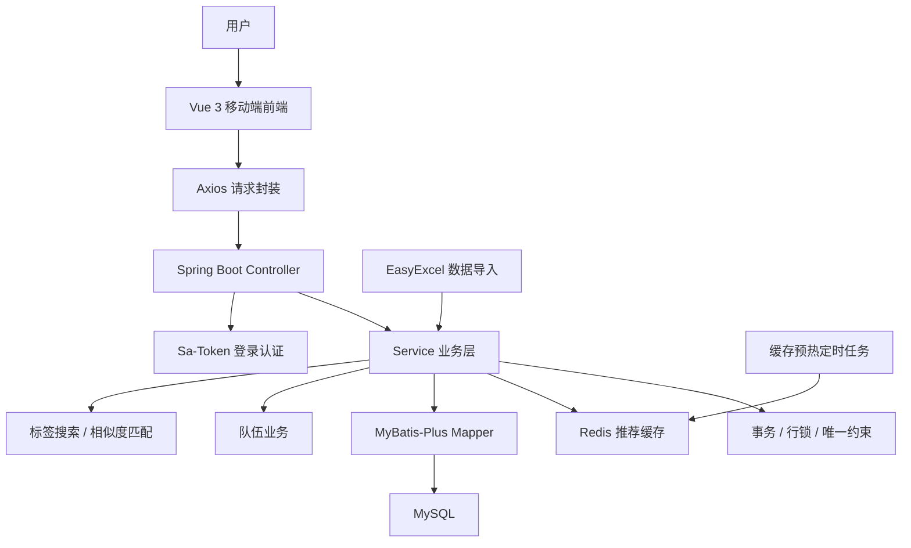
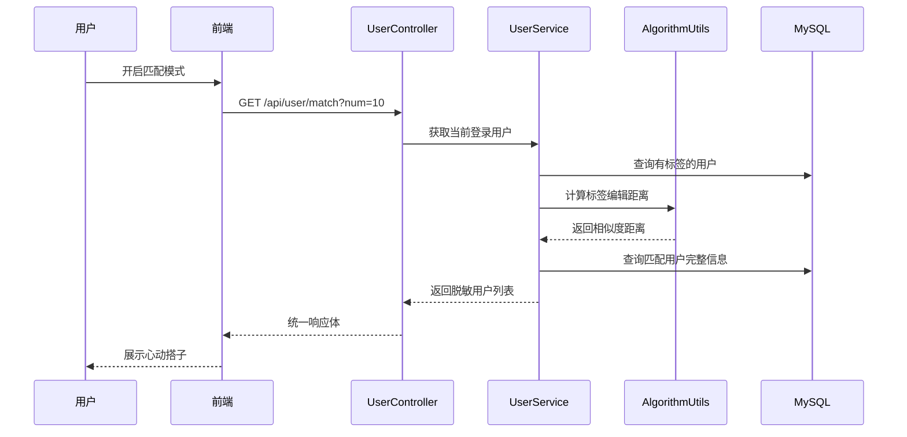
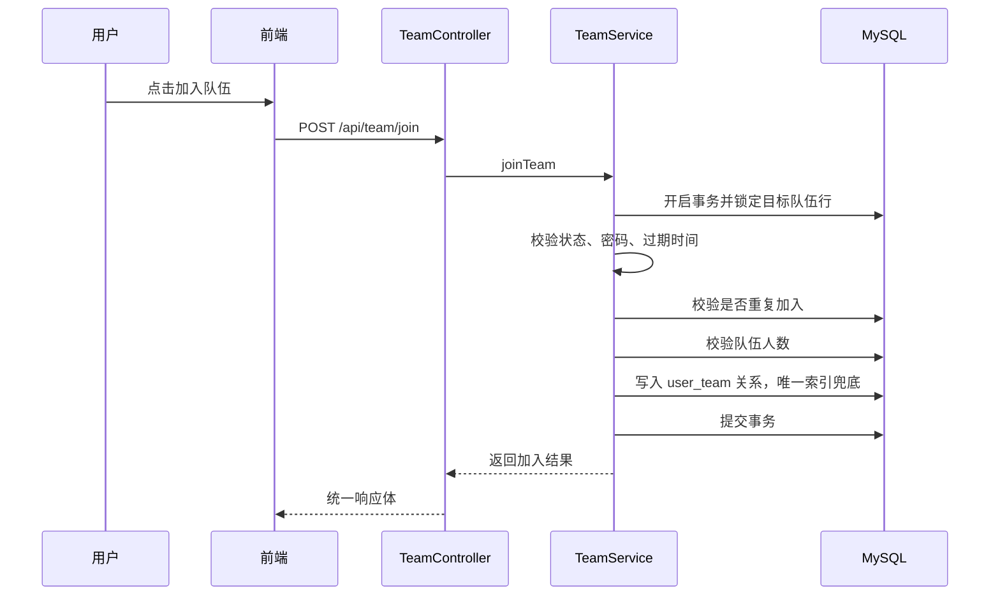
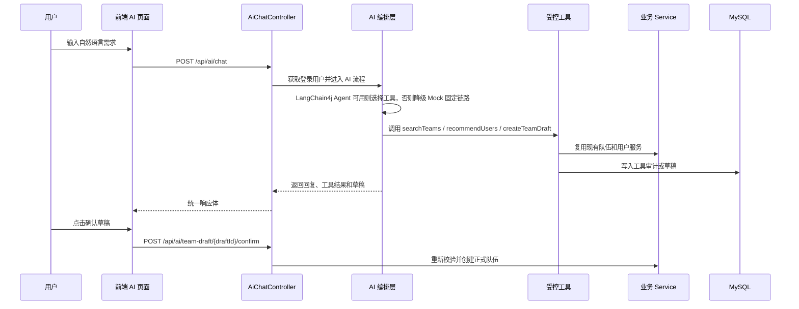

<div align="center">
  <h1>
    Sync Up
  </h1>

  <p>
    <a href="https://openjdk.org/projects/jdk/21/"></a>
    <a href="https://spring.io/projects/spring-boot"></a>
    <a href="https://vuejs.org/"></a>
    <a href="https://www.typescriptlang.org/"></a>
    <a href="https://baomidou.com/"></a>
    <a href="https://sa-token.cc/"></a>
    <a href="https://redis.io/"></a>
    <a href="LICENSE"></a>
  </p>
</div>

Sync Up 是一个面向移动端的找搭子与组队匹配系统，基于 Spring Boot 3、Vue 3、MyBatis-Plus、Sa-Token、Redis 和 Redisson 构建。

项目围绕“如何找到同频的人”这个业务场景展开：用户可以维护个人资料和标签，按标签搜索搭子，查看推荐用户，通过相似度算法匹配更接近的人，也可以创建队伍、加入队伍、退出队伍和管理自己的队伍。

当前阶段已补齐 AI 组队助手的第一阶段闭环：用户可以用自然语言查找队伍、推荐搭子、查看队伍详情、生成队伍草稿，并在确认后复用原有队伍服务创建正式队伍。

## 项目概览

```text
用户注册 / 登录
  -> 维护个人资料和标签
  -> 首页推荐 / 标签搜索 / 相似度匹配
  -> 创建队伍 / 加入队伍 / 退出队伍
  -> AI 助手解析自然语言 / 调用受控工具 / 生成待确认草稿
  -> Redis 推荐缓存 / 定时预热
  -> MySQL 事务 / 行锁 / 唯一约束控制入队一致性
  -> MySQL 持久化用户、队伍和加入关系
```

## 核心能力

**用户与登录认证**

- 支持用户注册、登录、退出和获取当前登录用户。
- 使用 Sa-Token 管理登录态，前端通过 `Authorization: Bearer <token>` 携带身份信息。
- 返回用户信息时做脱敏处理，避免密码等敏感字段泄露。
- 支持普通用户和管理员角色，管理员可以搜索和删除用户。

**标签搜索与搭子匹配**

- 用户可以维护个人标签，标签以 JSON 形式存储在用户表中。
- 支持按标签搜索用户，适合快速找到具备某些共同特征的人。
- 首页提供推荐用户列表，并使用 Redis 做短期缓存。
- 匹配模式使用编辑距离算法计算两组标签的接近程度，返回更相似的用户。

**队伍与协作关系**

- 支持创建、更新、查询、加入、退出和删除队伍。
- 队伍支持公开、私有、加密三种状态。
- 创建队伍时校验人数、名称、描述、状态、密码和过期时间。
- 加入队伍时校验是否过期、是否私有、密码是否正确、是否重复加入、队伍是否已满。
- 退出队伍时处理队长转移；队伍只剩一人时自动解散。

**AI 组队助手（阶段 1）**

- 支持 `POST /api/ai/chat`，根据自然语言识别组队需求。
- 支持受控工具：队伍查询、队伍详情、搭子推荐、队伍草稿、我创建的队伍、我的公开资料。
- 阶段 2 后扩展“我加入的队伍”和画像草稿工具；加入、退出队伍仍需在普通队伍页面由用户确认执行。
- 支持 LangChain4j 工具调用编排，默认关闭；未配置模型时自动降级到 Mock 解析和固定工具链。
- 模型默认配置为 `qwen3.6-flash-2026-04-16`，通过 DashScope / 百炼 OpenAI 兼容接口接入。
- 创建队伍只生成草稿，必须用户确认后才会写入 `team` 和 `user_team`。
- 工具调用和草稿确认写入 `ai_tool_call_log`，审计信息做脱敏摘要。

**AI 用户画像（阶段 2）**

- 用户可维护 `profile` 自我介绍，AI 画像接口可从自由文本提取结构化画像。
- 画像提取结果先进入 `ai_profile_extraction_task`，用户确认后才写入 `ai_user_profile`。
- 第一版采用规则化受控词表解析，保留候选标签，后续可替换为模型提取但接口和数据结构不变。
- 画像读取已接入 `getMyProfile` 工具，模型能看到用户确认过的结构化偏好。
- `updateMyProfile` 只生成待确认画像任务，用户确认后才更新自我介绍和正式结构化画像。
- 提取失败或画像表未初始化不会阻断注册、登录、资料编辑和原有 AI 助手能力。

**缓存、并发与工程实践**

- 推荐用户列表使用 Redis 缓存，减少重复数据库查询。
- 定时任务对重点用户的推荐列表做缓存预热。
- 加入队伍使用数据库事务、目标队伍行锁和 `user_team(userId, teamId)` 唯一索引兜底，避免重复加入和队伍人数超限。
- 创建队伍、退出队伍和删除队伍涉及多表写入，使用本地事务保证一致性。
- 使用 EasyExcel 支持一次性批量导入用户数据。
- 使用统一响应体、错误码和全局异常处理，减少 Controller 重复代码。

## 架构

整体架构如下：



简化链路：

```text
Vue 3 前端
  -> Axios 请求封装
  -> Spring Boot Controller
  -> Sa-Token 登录校验
  -> Service 业务层
      -> 用户资料 / 标签搜索 / 搭子匹配
      -> 队伍创建 / 加入 / 退出 / 删除
      -> Redis 缓存 / 本地事务 / 数据库约束
  -> MyBatis-Plus
  -> MySQL
```

## 主要链路

### 搭子匹配链路



这条链路没有一开始引入复杂推荐系统。当前阶段用户标签量和业务规则都不复杂，编辑距离算法足够清晰、可解释，也方便后续替换为更复杂的推荐策略。

### 加入队伍链路



这条链路的重点是控制并发抢占。如果多人同时加入同一个队伍，只靠前端判断或普通查询都不可靠，所以服务端在本地事务中锁定目标队伍行，重新校验容量，并用数据库唯一索引阻止重复加入。Redisson 仍可用于缓存预热等协调场景，但当前入队正确性不依赖它。

### AI 组队助手链路



这条链路的原则是“模型负责理解和选择，后端负责边界”。模型不能直接传入用户身份，不能直接写正式业务表，所有写入动作都必须经过确认接口。

## 功能模块

| 模块 | 说明 |
| --- | --- |
| 用户模块 | 注册、登录、退出、当前用户、用户更新、管理员查询和删除 |
| 标签模块 | 用户标签维护、按标签搜索、标签 JSON 解析 |
| 推荐模块 | 首页推荐、Redis 缓存、定时缓存预热 |
| 匹配模块 | 基于编辑距离的标签相似度匹配 |
| 队伍模块 | 创建、更新、查询、加入、退出、删除、我创建、我加入 |
| AI 助手模块 | 自然语言组队、受控工具调用、队伍草稿、确认创建、工具审计 |
| 导入模块 | EasyExcel 批量导入用户数据 |
| 基础能力 | 统一响应、错误码、全局异常、逻辑删除、接口文档配置 |

## 数据库设计

核心表如下：

| 表名 | 作用 |
| --- | --- |
| `user` | 用户信息、账号、密码、头像、联系方式、角色、星球编号、标签 JSON |
| `team` | 队伍信息、最大人数、过期时间、队长、状态、密码 |
| `user_team` | 用户和队伍的加入关系 |
| `tag` | 标签表，当前可以不启用，因为用户标签已存入 `user.tags` |
| `ai_team_draft` | AI 生成的队伍草稿、确认状态、过期时间和确认后的队伍 ID |
| `ai_tool_call_log` | AI 工具调用和草稿确认的脱敏审计记录 |
| `ai_user_profile` | 用户确认后的结构化 AI 画像 |
| `ai_profile_extraction_task` | 画像提取任务、状态、来源文本和提取结果 |
| `ai_chat_memory` | AI 短期会话记忆，保存 24 小时内的 LangChain4j 消息窗口 |

设计取舍：

- 主键使用自增 `BIGINT`，对中小型项目足够直接。
- 时间字段使用 `DATETIME`，表中保留 `createTime` 和 `updateTime`。
- 使用 `isDelete` 配合 MyBatis-Plus 做逻辑删除。
- 当前标签存在 `user.tags` 字段中，适合快速落地；如果后续标签查询、统计、推荐规则变复杂，再拆成标签关系表更稳妥。
- 当前不依赖数据库外键，关系一致性主要由业务层和事务维护，部署和迁移成本更低。
- AI 相关表只保存草稿、画像和审计摘要，不保存登录 Token、模型 API Key、队伍密码和完整敏感内容；画像来源文本会做手机号、邮箱和密钥类信息最小化处理。

## 接口概览

后端统一前缀为 `/api`。

### 用户接口

| 方法 | 路径 | 说明 |
| --- | --- | --- |
| `POST` | `/api/user/register` | 用户注册 |
| `POST` | `/api/user/login` | 用户登录 |
| `POST` | `/api/user/logout` | 用户退出 |
| `GET` | `/api/user/current` | 获取当前登录用户 |
| `GET` | `/api/user/search` | 管理员按用户名搜索用户 |
| `GET` | `/api/user/search/tags` | 按标签搜索用户 |
| `GET` | `/api/user/recommend` | 推荐用户分页列表 |
| `GET` | `/api/user/match` | 获取最匹配的用户 |
| `POST` | `/api/user/update` | 更新用户信息 |
| `POST` | `/api/user/delete` | 管理员删除用户 |

### 队伍接口

| 方法 | 路径 | 说明 |
| --- | --- | --- |
| `POST` | `/api/team/add` | 创建队伍 |
| `POST` | `/api/team/update` | 更新队伍 |
| `GET` | `/api/team/get` | 根据 ID 获取队伍 |
| `GET` | `/api/team/list` | 查询队伍列表 |
| `GET` | `/api/team/list/page` | 分页查询队伍 |
| `POST` | `/api/team/join` | 加入队伍 |
| `POST` | `/api/team/quit` | 退出队伍 |
| `POST` | `/api/team/delete` | 删除队伍 |
| `GET` | `/api/team/list/my/create` | 我创建的队伍 |
| `GET` | `/api/team/list/my/join` | 我加入的队伍 |

### AI 接口

| 方法 | 路径 | 说明 |
| --- | --- | --- |
| `POST` | `/api/ai/chat` | AI 组队助手对话入口 |
| `POST` | `/api/ai/team/{teamId}/details` | AI 工具路径下的队伍详情查询 |
| `POST` | `/api/ai/team-draft/{draftId}/confirm` | 确认 AI 队伍草稿并创建正式队伍 |
| `GET` | `/api/ai/profile/current` | 查询当前用户已确认的结构化画像 |
| `POST` | `/api/ai/profile/extract` | 从自我介绍文本生成待确认画像任务 |
| `POST` | `/api/ai/profile-task/{taskId}/confirm` | 确认画像任务并保存当前画像 |
| `POST` | `/api/ai/profile-task/{taskId}/reject` | 拒绝画像任务 |

统一响应格式：

```json
{
  "code": 0,
  "message": "ok",
  "data": {}
}
```

## 技术栈

后端：

- Java 21
- Spring Boot 3.5.15
- MyBatis-Plus 3.5.12
- MySQL
- Redis / Spring Data Redis
- Sa-Token
- Redisson
- LangChain4j 1.14
- EasyExcel
- Knife4j / Springdoc OpenAPI
- Gson
- Maven

前端：

- Vue 3
- TypeScript
- Vite
- Vant UI
- Vue Router
- Axios
- qs

## 项目结构

```text
sync-up
├── src/main/java/com/mikle/syncup
│   ├── common        # 统一响应、错误码、通用请求对象
│   ├── ai            # AI 助手、受控工具、草稿、审计、意图评测
│   ├── config        # MyBatis-Plus、Redis、Redisson、Knife4j、Web MVC 配置
│   ├── constant      # 常量
│   ├── controller    # 用户接口、队伍接口
│   ├── exception     # 业务异常和全局异常处理
│   ├── job           # 定时缓存预热任务
│   ├── mapper        # MyBatis-Plus Mapper
│   ├── model         # domain、request、dto、vo、enum
│   ├── once          # 一次性数据导入脚本
│   ├── service       # 业务接口与实现
│   └── utils         # 匹配算法工具
├── src/main/resources
│   ├── mapper        # MyBatis XML
│   ├── application.yml
│   └── application-prod.yml
├── syncup-frontend   # Vue 3 移动端前端
├── sql               # 数据库初始化脚本
└── imgs              # 项目图片资源
```

## 本地启动

### 前置条件

启动项目前，请先准备：

- JDK 21
- Maven
- Node.js 和 npm
- MySQL 8
- Redis

不要提交真实密钥和生产数据库配置。正式部署时，数据库密码、Redis 密码等敏感配置建议通过环境变量或独立的本地 profile 注入。

### 后端

按本机环境修改：

```text
.env
```

可以从 `.env.example` 复制一份本地配置。不要把真实数据库密码、Redis 密码或生产密钥提交到仓库。

初始化新数据库：

```bash
mysql -u root -p < sql/create_table.sql
```

已有数据库按阶段升级时，推荐顺序如下：

```bash
mysql -u root -p sync_up_db < sql/stage0_baseline_migration.sql
mysql -u root -p sync_up_db < sql/stage0_5_team_search_migration.sql
mysql -u root -p sync_up_db < sql/stage1_3_ai_team_draft_migration.sql
mysql -u root -p sync_up_db < sql/stage1_4_ai_audit_migration.sql
mysql -u root -p sync_up_db < sql/stage2_ai_user_profile_migration.sql
mysql -u root -p sync_up_db < sql/stage2_1_ai_chat_memory_migration.sql
```

AI Agent 默认关闭，不影响本地启动。需要接入真实模型时，在 `.env` 或运行环境中配置：

```properties
SYNC_UP_AI_AGENT_ENABLED=true
DASHSCOPE_API_KEY=你的百炼或 DashScope API Key
SYNC_UP_AI_AGENT_MODEL=qwen3.6-flash-2026-04-16
SYNC_UP_AI_MEMORY_MAX_MESSAGES=20
SYNC_UP_AI_MEMORY_REDIS_TTL_HOURS=12
SYNC_UP_AI_MEMORY_MYSQL_TTL_HOURS=24
```

启动后端：

```bash
./mvnw spring-boot:run
```

Windows：

```bash
mvnw.cmd spring-boot:run
```

编译检查：

```bash
./mvnw -DskipTests compile
```

如果本机没有可用的 Maven Wrapper，或 Windows PowerShell 执行策略阻止脚本运行，可以使用本机 Maven，并将依赖仓库放到项目目录：

```bash
mvn "-Dmaven.repo.local=.m2/repository" test
```

后端接口默认地址：

```text
http://localhost:8080/api
```

### 前端

```bash
cd syncup-frontend
npm install
npm run dev
```

Windows PowerShell 如果拦截 `npm.ps1`，使用：

```bash
npm.cmd run dev
```

类型检查：

```bash
npm run type-check
```

构建：

```bash
npm run build
```

前端开发环境默认请求：

```text
http://localhost:8080/api
```

## AI 阶段 1 验收

阶段 1 的验收目标是证明 AI 助手可以形成最小闭环，而不是宣传完整智能推荐系统。

### 演示脚本

1. 登录用户。
2. 在 AI 页面输入：`我想这个周末在西安找羽毛球搭子，预算每人50以内`。
3. 后端识别组队需求，调用 `searchTeams` 返回可加入队伍。
4. 同一轮调用 `recommendUsers` 返回搭子推荐和推荐原因。
5. 点击队伍卡片“详情”，调用 `getTeamDetails` 查看人数、地点、时间和创建者。
6. 输入：`帮我在西安创建一个4人的羽毛球队伍，预算每人50以内`。
7. 后端只生成 `createTeamDraft` 草稿，不写正式队伍表。
8. 用户点击确认后，调用 `POST /api/ai/team-draft/{draftId}/confirm` 创建正式队伍并自动加入。
9. 查询 `ai_tool_call_log`，确认搜索、推荐、详情、草稿和确认动作都有审计记录。

### 固定评测集

当前固定评测集为 `src/test/resources/ai/intent-evaluation-v1.json`，共 30 条样本。当前基线对象是 `MockTeamIntentParser`，不是大模型效果。

最近一次阶段 1 验证指标：

| 指标 | 结果 |
| --- | --- |
| 样本数 | 30 |
| 关键槽位准确率 | 147/150，98.00% |
| 确定性工具路由准确率 | 30/30，100.00% |
| 缺失字段集合准确率 | 30/30，100.00% |

### 验证命令

后端阶段 1 测试：

```bash
mvn "-Dmaven.repo.local=.m2/repository" "-Dtest=AiChatServiceTest,AiIntentEvaluationTest" test
```

前端验证：

```bash
cd syncup-frontend
npm.cmd run type-check
npm.cmd run build
```

### 已知限制

- 未配置 `DASHSCOPE_API_KEY` 时，AI 助手默认使用 Mock 解析和固定工具链。
- 真实模型工具调用默认关闭，需要显式开启 `SYNC_UP_AI_AGENT_ENABLED=true`。
- 当前推荐仍是标签匹配和编辑距离基线，不是向量召回或复杂语义推荐。
- 当前没有长期记忆、内容审核后台、复杂 Agent 工作流和向量数据库；只保留短期会话记忆。
- 个人信息更新只暴露受控的 `updateMyProfile` 草稿工具；模型不能直接修改自我介绍、正式画像、账号、手机号、邮箱或角色。

## AI 短期会话记忆

真实模型开启后，AI 助手使用 LangChain4j `chatMemoryProvider` 读取短期上下文，解决“刚才那个队伍”“加入第一个”“继续修改我的资料”这类连续对话问题。

设计取舍：

- `memoryId = userId:sessionId`，避免不同用户之间串话。
- Redis 缓存 `syncup:ai:chat-memory:{memoryId}`，默认保留 12 小时。
- MySQL 表 `ai_chat_memory` 默认保留 24 小时，并由定时任务每小时物理清理过期数据。
- 第一版使用 `MessageWindowChatMemory`，默认最多保留最近 20 条消息。
- 只做短期会话记忆；长期偏好仍由 `ai_user_profile` 管理。

## AI 阶段 2 验收

阶段 2 的目标是让用户画像进入可解释、可确认、可回滚的结构化状态，而不是让模型直接覆盖用户标签。

### 核心流程

```text
用户编辑自我介绍 / 调用画像提取接口
  -> Agent 识别更新意图并调用 updateMyProfile 生成草稿，或用户调用画像提取接口
  -> 规则化画像提取
  -> 写入 ai_profile_extraction_task
  -> 用户确认或拒绝
  -> 确认后更新 user.profile 并写入 ai_user_profile
  -> getMyProfile 工具读取已确认画像
```

### 验证命令

```bash
mvn "-Dmaven.repo.local=.m2/repository" "-Dtest=AiUserProfileServiceTest,AiChatServiceTest" test
```

当前覆盖：

- 画像提取、确认、当前画像读取。
- `updateMyProfile` 工具只生成画像草稿，确认接口负责更新 `user.profile` 和结构化画像。
- `listMyJoinedTeams` 复用原队伍 Service；`joinTeam`、`quitTeam` 不向模型暴露，入退队由普通页面确认执行。
- 拒绝画像任务后不写入当前画像。
- 其他用户不能确认画像任务。
- 阶段 1 AI 聊天、工具调用、草稿确认链路回归通过。

## License

本项目基于 [Apache License 2.0](LICENSE) 开源。
