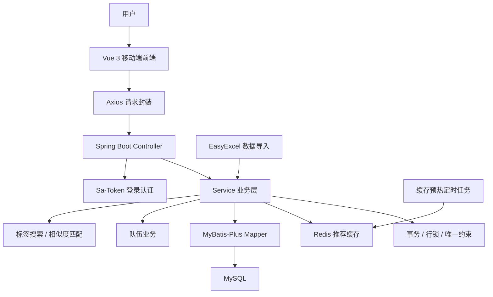
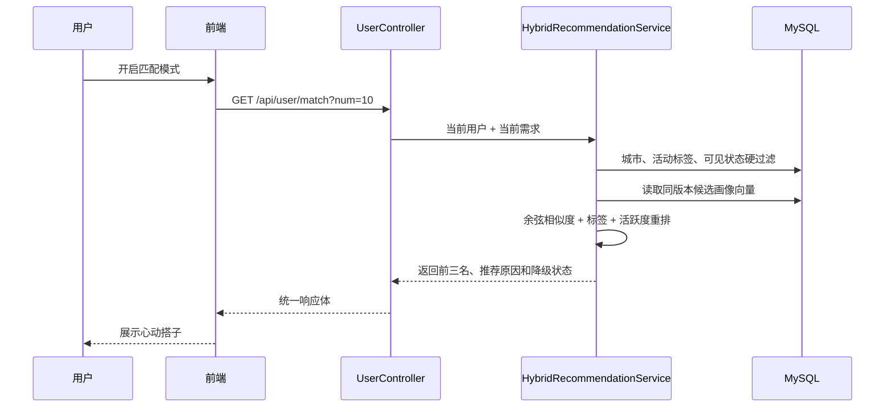
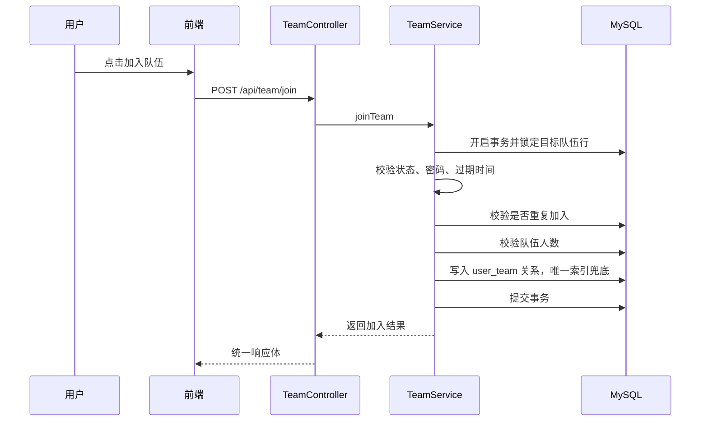
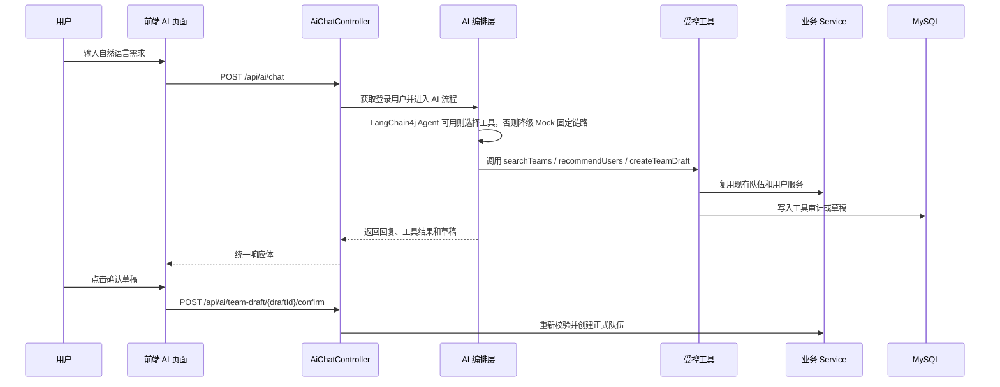

<div align="center">
  <h1>
    Sync Up
  </h1>

  <p>
    <a href="https://openjdk.org/projects/jdk/21/"></a>
    <a href="https://spring.io/projects/spring-boot"></a>
    <a href="https://vuejs.org/"></a>
    <a href="https://www.typescriptlang.org/"></a>
    <a href="https://baomidou.com/"></a>
    <a href="https://sa-token.cc/"></a>
    <a href="https://redis.io/"></a>
    <a href="LICENSE"></a>
  </p>
</div>

Sync Up 是一个面向移动端的找搭子与组队匹配系统，基于 Spring Boot 3、Vue 3、MyBatis-Plus、Sa-Token、Redis 和 Redisson 构建。

项目围绕“如何找到同频的人”这个业务场景展开：用户可以维护个人资料和标签，按标签搜索搭子，也可以通过“结构化硬过滤 + 画像语义排序”寻找更匹配的搭子或队伍，并完成创建、加入、退出和管理队伍。

当前阶段已完成 AI 组队助手、内部用户画像和第一版混合推荐：用户可以用自然语言查找队伍、推荐搭子、查看队伍详情、生成队伍草稿；系统会根据自我介绍生成内部五段式画像，并结合本轮需求完成硬过滤、向量排序、业务重排和失败降级。

项目文档：

- [迭代路线图](sync-up%20修改建议.md)：里程碑、阶段状态和验收条件。
- [当前实施状态](IMPLEMENTATION_STATUS.md)：已实现代码、最近验证结果和已知问题。
- [架构约束](ARCHITECTURE.md)：模块边界、AI 工具安全、事务和数据设计原则。

## 项目概览

```text
用户注册 / 登录
  -> 维护个人资料和标签
  -> 首页推荐 / 标签搜索 / 混合匹配
  -> 创建队伍 / 加入队伍 / 退出队伍
  -> AI 助手解析自然语言 / 调用受控工具 / 生成待确认草稿
  -> Redis 推荐缓存 / 定时预热
  -> MySQL 事务 / 行锁 / 唯一约束控制入队一致性
  -> MySQL 持久化用户、队伍和加入关系
```

## 核心能力

**用户与登录认证**

- 支持用户注册、登录、退出和获取当前登录用户。
- 使用 Sa-Token 管理登录态，前端通过 `Authorization: Bearer <token>` 携带身份信息。
- 返回用户信息时做脱敏处理，避免密码等敏感字段泄露。
- 支持普通用户和管理员角色，管理员可以搜索和删除用户。

**标签搜索与搭子匹配**

- 用户可以维护个人标签，标签以 JSON 形式存储在用户表中。
- 支持按标签搜索用户，适合快速找到具备某些共同特征的人。
- 首页提供推荐用户列表，并使用 Redis 做短期缓存。
- 匹配模式先按城市、活动标签和可见状态筛选，再结合本轮需求、内部匹配画像、标签重合度和活跃度排序。

**队伍与协作关系**

- 支持创建、更新、查询、加入、退出和删除队伍。
- 队伍支持公开、私有、加密三种状态。
- 创建队伍时校验人数、名称、描述、状态、密码和过期时间。
- 加入队伍时校验是否过期、是否私有、密码是否正确、是否重复加入、队伍是否已满。
- 退出队伍时处理队长转移；队伍只剩一人时自动解散。

**AI 组队助手（阶段 1）**

- 支持 `POST /api/ai/chat`，根据自然语言识别组队需求。
- 支持受控工具：队伍查询、队伍详情、搭子推荐、队伍草稿、我创建的队伍、我的公开资料。
- 支持“我加入的队伍”和“我的公开资料”查询；加入、退出队伍以及修改自我介绍仍需在普通页面执行。
- 支持 LangChain4j 工具调用编排，默认关闭；未配置模型时自动降级到 Mock 解析和固定工具链。
- 模型默认配置为 `qwen3.7-max-2026-05-20`，通过 DashScope / 百炼 OpenAI 兼容接口接入。
- 创建队伍只生成草稿，必须用户确认后才会写入 `team` 和 `user_team`。
- 工具调用和草稿确认写入 `ai_tool_call_log`，审计信息做脱敏摘要。

**AI 用户画像（阶段 2）**

- 用户只维护 `user.profile` 自我介绍；AI 画像是系统内部派生数据，不提供查看、确认、拒绝或修改接口。
- 自我介绍发生变化后创建 `ai_profile_generation_task`，定时批量调用模型生成五段式文本画像。
- `profileText` 保存完整画像，`matchProfileText` 只保留前四段，`interactionProfileText` 只保留 AI 交流偏好。
- 系统只为 `matchProfileText` 生成一个整体 Embedding，并保存模型、维度、画像版本和生成状态；向量写入前统一做归一化。
- 城市、性别、账号等确定信息不重复写入 AI 画像，后续匹配继续从用户资料做硬条件过滤。
- AI 助手只在内部加载 `interactionProfileText` 调整表达方式，不通过工具或前端返回画像正文。
- 任务支持抢占、重试、超时恢复和新任务淘汰旧任务；只有新文本和新向量都成功后才原子切换版本，任一步失败都保留上一有效版本且不阻断资料编辑。
- 固定画像质量参考集包含 10 类自我介绍，离线检查五段完整性、已表达事实保留、敏感或无依据推断排除，以及匹配文本与交互文本隔离。
- `interactionProfileText` 不参与推荐；搭子和队伍只使用前四段派生的 `matchProfileText` 形成查询语义。

**混合推荐（阶段 3）**

- 搭子推荐使用城市、活动标签等硬条件生成最多 100 条候选，再按画像语义、标签重合度和活跃度重排。
- 队伍推荐先过滤城市、活动、时间、预算、水平、状态、过期时间和余位，再比较查询向量与版本化队伍检索向量。
- 队伍检索文本由公开稳定字段生成；内容变更后旧向量立即失效，后台任务生成新版本。
- 推荐默认返回前三名和可公开的主要原因，不向用户暴露内部画像正文或敏感推断。
- Embedding 服务失败、向量缺失或版本不一致时自动降级为标签或结构化业务排序。
- 第一版在应用内计算有限候选集余弦相似度，不引入独立向量数据库。
- 10 条合成向量固定样本用于代码回归；真实模型效果仍需单独使用人工相关性标注评测。

**缓存、并发与工程实践**

- 推荐用户列表使用 Redis 缓存，减少重复数据库查询。
- 定时任务对重点用户的推荐列表做缓存预热。
- 加入队伍使用数据库事务、目标队伍行锁和 `user_team(userId, teamId)` 唯一索引兜底，避免重复加入和队伍人数超限。
- 创建队伍、退出队伍和删除队伍涉及多表写入，使用本地事务保证一致性。
- 使用 EasyExcel 支持一次性批量导入用户数据。
- 使用统一响应体、错误码和全局异常处理，减少 Controller 重复代码。

## 架构

整体架构如下：


```mermaid
flowchart TD
    User["用户"]
    Frontend["Vue 3 移动端前端"]
    Axios["Axios 请求封装"]
    Controller["Spring Boot Controller"]
    Service["Service 业务层"]
    Mapper["MyBatis-Plus Mapper"]
    Auth["Sa-Token 登录认证"]
    Match["标签搜索 / 相似度匹配"]
    Team["队伍业务"]
    Cache["Redis 推荐缓存"]
    Consistency["事务 / 行锁 / 唯一约束"]
    Job["缓存预热定时任务"]
    Import["EasyExcel 数据导入"]
    DB["MySQL"]

    User --> Frontend
    Frontend --> Axios
    Axios --> Controller
    Controller --> Auth
    Controller --> Service
    Service --> Match
    Service --> Team
    Service --> Mapper
    Service --> Cache
    Service --> Consistency
    Job --> Cache
    Import --> Service
    Mapper --> DB
```

简化链路：

```text
Vue 3 前端
  -> Axios 请求封装
  -> Spring Boot Controller
  -> Sa-Token 登录校验
  -> Service 业务层
      -> 用户资料 / 标签搜索 / 搭子匹配
      -> 队伍创建 / 加入 / 退出 / 删除
      -> Redis 缓存 / 本地事务 / 数据库约束
  -> MyBatis-Plus
  -> MySQL
```

## 主要链路

### 搭子匹配链路


```mermaid
sequenceDiagram
    participant U as 用户
    participant F as 前端
    participant C as UserController
    participant R as HybridRecommendationService
    participant D as MySQL

    U->>F: 开启匹配模式
    F->>C: GET /api/user/match?num=10
    C->>R: 当前用户 + 当前需求
    R->>D: 城市、活动标签、可见状态硬过滤
    R->>D: 读取同版本候选画像向量
    R->>R: 余弦相似度 + 标签 + 活跃度重排
    R-->>C: 返回前三名、推荐原因和降级状态
    C-->>F: 统一响应体
    F-->>U: 展示心动搭子
```

这条链路保持有限候选集和应用内排序，避免过早引入向量数据库。Embedding 不可用时仍可使用标签与活跃度完成确定性降级。

### 加入队伍链路


```mermaid
sequenceDiagram
    participant U as 用户
    participant F as 前端
    participant C as TeamController
    participant S as TeamService
    participant D as MySQL

    U->>F: 点击加入队伍
    F->>C: POST /api/team/join
    C->>S: joinTeam
    S->>D: 开启事务并锁定目标队伍行
    S->>S: 校验状态、密码、过期时间
    S->>D: 校验是否重复加入
    S->>D: 校验队伍人数
    S->>D: 写入 user_team 关系，唯一索引兜底
    S->>D: 提交事务
    S-->>C: 返回加入结果
    C-->>F: 统一响应体
```

这条链路的重点是控制并发抢占。如果多人同时加入同一个队伍，只靠前端判断或普通查询都不可靠，所以服务端在本地事务中锁定目标队伍行，重新校验容量，并用数据库唯一索引阻止重复加入。Redisson 仍可用于缓存预热等协调场景，但当前入队正确性不依赖它。

### AI 组队助手链路


```mermaid
sequenceDiagram
    participant U as 用户
    participant F as 前端 AI 页面
    participant C as AiChatController
    participant A as AI 编排层
    participant T as 受控工具
    participant S as 业务 Service
    participant D as MySQL

    U->>F: 输入自然语言需求
    F->>C: POST /api/ai/chat
    C->>A: 获取登录用户并进入 AI 流程
    A->>A: LangChain4j Agent 可用则选择工具，否则降级 Mock 固定链路
    A->>T: 调用 searchTeams / recommendUsers / createTeamDraft
    T->>S: 复用现有队伍和用户服务
    T->>D: 写入工具审计或草稿
    A-->>C: 返回回复、工具结果和草稿
    C-->>F: 统一响应体
    U->>F: 点击确认草稿
    F->>C: POST /api/ai/team-draft/{draftId}/confirm
    C->>S: 重新校验并创建正式队伍
```

这条链路的原则是“模型负责理解和选择，后端负责边界”。模型不能直接传入用户身份，不能直接写正式业务表，所有写入动作都必须经过确认接口。

## 功能模块

| 模块 | 说明 |
| --- | --- |
| 用户模块 | 注册、登录、退出、当前用户、用户更新、管理员查询和删除 |
| 标签模块 | 用户标签维护、按标签搜索、标签 JSON 解析 |
| 推荐模块 | 首页推荐、Redis 缓存、定时缓存预热 |
| 匹配模块 | 城市与活动硬过滤、画像向量排序、业务重排、推荐原因和失败降级 |
| 队伍模块 | 创建、更新、查询、加入、退出、删除、我创建、我加入 |
| AI 助手模块 | 自然语言组队、受控工具调用、队伍草稿、确认创建、工具审计 |
| 导入模块 | EasyExcel 批量导入用户数据 |
| 基础能力 | 统一响应、错误码、全局异常、逻辑删除、接口文档配置 |

## 数据库设计

核心表如下：

| 表名 | 作用 |
| --- | --- |
| `user` | 用户信息、账号、密码、头像、联系方式、角色、标签 JSON |
| `team` | 队伍信息、最大人数、过期时间、队长、状态、密码 |
| `user_team` | 用户和队伍的加入关系 |
| `tag` | 标签表，当前可以不启用，因为用户标签已存入 `user.tags` |
| `ai_team_draft` | AI 生成的队伍草稿、确认状态、过期时间和确认后的队伍 ID |
| `ai_tool_call_log` | AI 工具调用和草稿确认的脱敏审计记录 |
| `ai_user_profile` | 系统内部五段式文本画像、匹配文本、交互文本及版本元数据 |
| `ai_profile_generation_task` | 自我介绍变更产生的画像生成任务、重试状态和错误摘要 |
| `ai_user_profile_embedding` | 匹配画像的归一化向量、画像版本、模型、维度和有效状态 |
| `ai_team_embedding` | 队伍检索文本的归一化向量、内容版本、哈希、模型、维度和有效状态 |
| `ai_chat_memory` | AI 短期会话记忆，保存 24 小时内的 LangChain4j 消息窗口 |
| `ai_chat_message` | 用户消息、助手响应和隐藏业务事件，用于恢复最近聊天历史 |

设计取舍：

- 主键使用自增 `BIGINT`，对中小型项目足够直接。
- 时间字段使用 `DATETIME`，表中保留 `createTime` 和 `updateTime`。
- 使用 `isDelete` 配合 MyBatis-Plus 做逻辑删除。
- 当前标签存在 `user.tags` 字段中，适合快速落地；如果后续标签查询、统计、推荐规则变复杂，再拆成标签关系表更稳妥。
- 当前不依赖数据库外键，关系一致性主要由业务层和事务维护，部署和迁移成本更低。
- AI 相关表不保存登录 Token、模型 API Key 和队伍密码；画像任务中的自我介绍快照会做手机号、邮箱和密钥类信息最小化处理。

## 接口概览

后端统一前缀为 `/api`。

### 用户接口

| 方法 | 路径 | 说明 |
| --- | --- | --- |
| `POST` | `/api/user/register` | 用户注册 |
| `POST` | `/api/user/login` | 用户登录 |
| `POST` | `/api/user/logout` | 用户退出 |
| `GET` | `/api/user/current` | 获取当前登录用户 |
| `GET` | `/api/user/search` | 管理员按用户名搜索用户 |
| `GET` | `/api/user/search/tags` | 按标签搜索用户 |
| `GET` | `/api/user/recommend` | 推荐用户分页列表 |
| `GET` | `/api/user/match` | 获取最匹配的用户 |
| `POST` | `/api/user/update` | 更新用户信息 |
| `POST` | `/api/user/delete` | 管理员删除用户 |

### 队伍接口

| 方法 | 路径 | 说明 |
| --- | --- | --- |
| `POST` | `/api/team/add` | 创建队伍 |
| `POST` | `/api/team/update` | 更新队伍 |
| `GET` | `/api/team/get` | 根据 ID 获取队伍 |
| `GET` | `/api/team/list` | 查询队伍列表 |
| `GET` | `/api/team/list/page` | 分页查询队伍 |
| `POST` | `/api/team/join` | 加入队伍 |
| `POST` | `/api/team/quit` | 退出队伍 |
| `POST` | `/api/team/delete` | 删除队伍 |
| `GET` | `/api/team/list/my/create` | 我创建的队伍 |
| `GET` | `/api/team/list/my/join` | 我加入的队伍 |

### AI 接口

| 方法 | 路径 | 说明 |
| --- | --- | --- |
| `POST` | `/api/ai/chat` | AI 组队助手对话入口 |
| `POST` | `/api/ai/team/{teamId}/details` | AI 工具路径下的队伍详情查询 |
| `POST` | `/api/ai/team-draft/{draftId}/confirm` | 确认 AI 队伍草稿并创建正式队伍 |

AI 用户画像没有用户侧 REST 接口。用户通过 `/api/user/update` 维护自我介绍，画像生成由后端内部触发。

统一响应格式：

```json
{
  "code": 0,
  "message": "ok",
  "data": {}
}
```

## 技术栈

后端：

- Java 21
- Spring Boot 3.5.15
- MyBatis-Plus 3.5.12
- MySQL
- Redis / Spring Data Redis
- Sa-Token
- Redisson
- LangChain4j 1.14
- EasyExcel
- Knife4j / Springdoc OpenAPI
- Gson
- Maven

前端：

- Vue 3
- TypeScript
- Vite
- Vant UI
- Vue Router
- Axios
- qs

## 项目结构

```text
sync-up
├── src/main/java/com/mikle/syncup
│   ├── common        # 统一响应、错误码、通用请求对象
│   ├── ai            # AI 助手、受控工具、草稿、审计、意图评测
│   ├── config        # MyBatis-Plus、Redis、Redisson、Knife4j、Web MVC 配置
│   ├── constant      # 常量
│   ├── controller    # 用户接口、队伍接口
│   ├── exception     # 业务异常和全局异常处理
│   ├── job           # 定时缓存预热任务
│   ├── mapper        # MyBatis-Plus Mapper
│   ├── model         # domain、request、dto、vo、enum
│   ├── once          # 一次性数据导入脚本
│   ├── service       # 业务接口与实现
│   └── utils         # 匹配算法工具
├── src/main/resources
│   ├── mapper        # MyBatis XML
│   ├── application.yml
│   └── application-prod.yml
├── syncup-frontend   # Vue 3 移动端前端
├── sql               # 数据库初始化脚本
└── imgs              # 项目图片资源
```

## 本地启动

### 前置条件

启动项目前，请先准备：

- JDK 21
- Maven
- Node.js 和 npm
- MySQL 8
- Redis

不要提交真实密钥和生产数据库配置。正式部署时，数据库密码、Redis 密码等敏感配置建议通过环境变量或独立的本地 profile 注入。

### 后端

按本机环境修改：

```text
.env
```

可以从 `.env.example` 复制一份本地配置。不要把真实数据库密码、Redis 密码或生产密钥提交到仓库。

初始化新数据库：

```bash
mysql -u root -p < sql/create_table.sql
```

已有数据库按阶段升级时，推荐顺序如下：

```bash
mysql -u root -p sync_up_db < sql/stage0_baseline_migration.sql
mysql -u root -p sync_up_db < sql/stage0_5_team_search_migration.sql
mysql -u root -p sync_up_db < sql/stage1_3_ai_team_draft_migration.sql
mysql -u root -p sync_up_db < sql/stage1_4_ai_audit_migration.sql
mysql -u root -p sync_up_db < sql/stage2_ai_user_profile_migration.sql
mysql -u root -p sync_up_db < sql/stage2_1_ai_chat_memory_migration.sql
mysql -u root -p sync_up_db < sql/stage2_2_ai_chat_message_migration.sql
mysql -u root -p sync_up_db < sql/stage2_3_internal_text_profile_migration.sql
mysql -u root -p sync_up_db < sql/stage2_4_ai_profile_embedding_migration.sql
mysql -u root -p sync_up_db < sql/stage3_team_activity_category_migration.sql
mysql -u root -p sync_up_db < sql/stage4_user_city_active_migration.sql
mysql -u root -p sync_up_db < sql/stage3_1_team_embedding_migration.sql
```

AI Agent 默认关闭，不影响本地启动。需要接入真实模型时，在 `.env` 或运行环境中配置：

```properties
SYNC_UP_AI_AGENT_ENABLED=true
DASHSCOPE_API_KEY=你的百炼或 DashScope API Key
SYNC_UP_AI_AGENT_MODEL=qwen3.7-max-2026-05-20
SYNC_UP_AI_EMBEDDING_ENABLED=true
SYNC_UP_AI_EMBEDDING_MODEL=text-embedding-v4
SYNC_UP_AI_EMBEDDING_DIMENSIONS=1024
SYNC_UP_AI_PROFILE_GENERATION_FIXED_DELAY_MS=60000
SYNC_UP_AI_TEAM_EMBEDDING_FIXED_DELAY_MS=60000
SYNC_UP_AI_MEMORY_MAX_MESSAGES=20
SYNC_UP_AI_MEMORY_REDIS_TTL_HOURS=12
SYNC_UP_AI_MEMORY_MYSQL_TTL_HOURS=24
```

启动后端：

```bash
./mvnw spring-boot:run
```

Windows：

```bash
mvnw.cmd spring-boot:run
```

编译检查：

```bash
./mvnw -DskipTests compile
```

如果本机没有可用的 Maven Wrapper，或 Windows PowerShell 执行策略阻止脚本运行，可以使用本机 Maven，并将依赖仓库放到项目目录：

```bash
mvn "-Dmaven.repo.local=.m2/repository" test
```

后端接口默认地址：

```text
http://localhost:8080/api
```

### 前端

```bash
cd syncup-frontend
npm install
npm run dev
```

Windows PowerShell 如果拦截 `npm.ps1`，使用：

```bash
npm.cmd run dev
```

类型检查：

```bash
npm run type-check
```

构建：

```bash
npm run build
```

前端开发环境默认请求：

```text
http://localhost:8080/api
```

## 验证与验收

README 只保留启动和验证入口：

- 当前真实进度、最近测试结果和已知问题见 [IMPLEMENTATION_STATUS.md](IMPLEMENTATION_STATUS.md)。
- 各阶段目标和验收条件见 [sync-up 修改建议.md](sync-up%20修改建议.md)。
- AI 工具、画像、记忆、事务和权限边界见 [ARCHITECTURE.md](ARCHITECTURE.md)。

后端全量测试：

    mvn.cmd "-Dmaven.repo.local=.m2/repository" test

前端验证：

    cd syncup-frontend
    npm.cmd run type-check
    npm.cmd run build

真实模型工具调用默认关闭。未配置模型时，普通业务和确定性降级链路仍应能够运行。Mock 固定评测只用于回归解析和工具路由，不代表真实模型效果。
## License

本项目基于 [Apache License 2.0](LICENSE) 开源。
