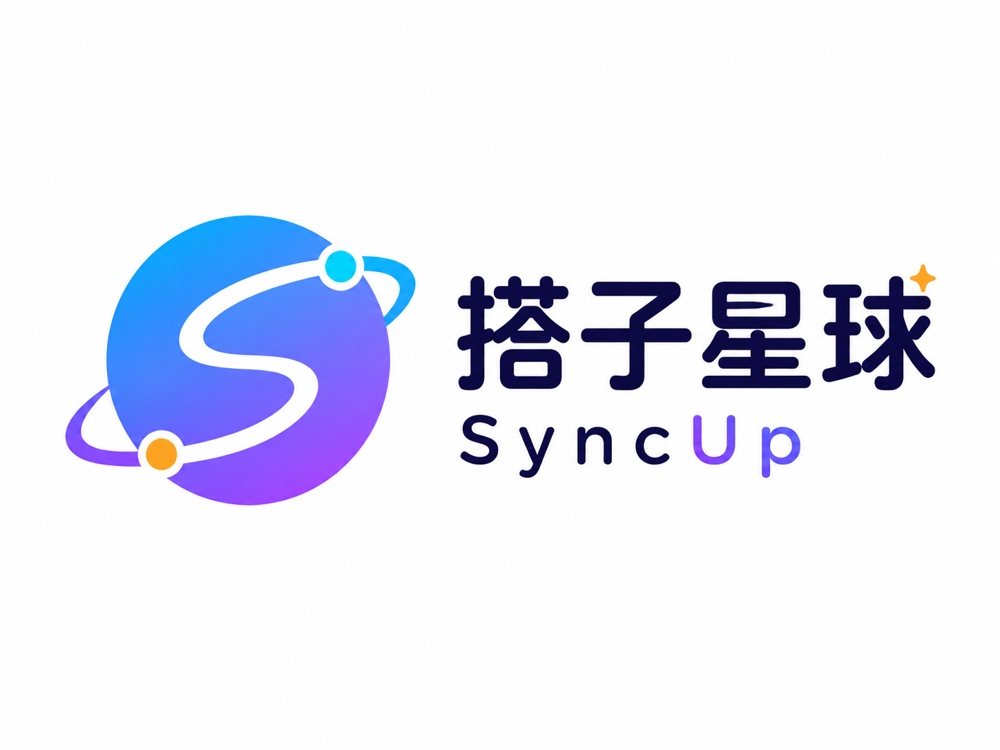
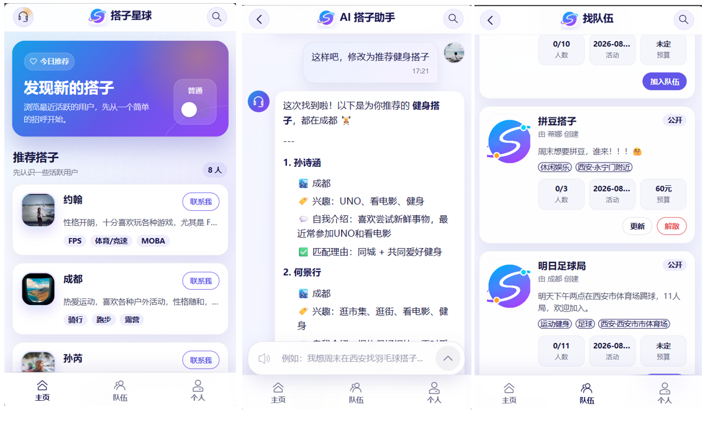
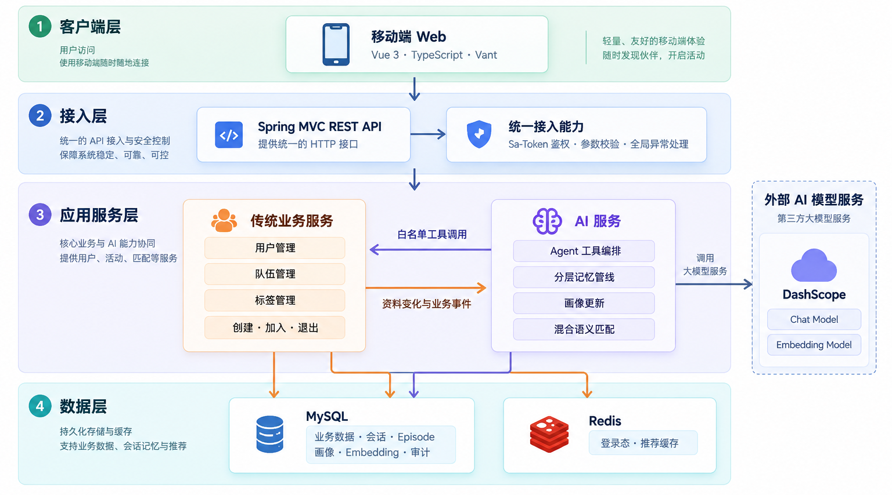

<div align="center">
  
  <h1>Sync Up</h1>
  <p>面向移动端的找搭子与组队系统，提供分层记忆、用户画像、混合语义匹配和受控 Agent 工具调用。</p>

  <p>
    <a href="https://openjdk.org/projects/jdk/21/"></a>
    <a href="https://spring.io/projects/spring-boot"></a>
    <a href="https://vuejs.org/"></a>
    <a href="https://github.com/langchain4j/langchain4j"></a>
    <a href="LICENSE"></a>
  </p>
</div>

Sync Up 是一个面向移动端的找搭子与组队匹配系统，基于 Spring Boot 3、Vue 3、MyBatis-Plus、Sa-Token、Redis 和 LangChain4j 构建。

项目围绕“如何找到同频的人”这个业务场景展开：用户可以维护个人资料和活动标签，搜索搭子，也可以通过“结构化硬过滤 + 画像语义排序”寻找更匹配的搭子或队伍，并完成队伍的创建、加入、退出和管理。

当前阶段已完成 AI 组队助手、分层记忆、内部用户画像和混合语义匹配：用户可以用自然语言查询队伍、推荐搭子、查看队伍详情和生成队伍草稿；系统会从自我介绍和对话中的稳定事实更新五维画像，并结合本轮需求完成硬过滤、向量排序、业务重排和失败降级。



## 核心亮点

### 分层记忆与画像更新

记忆由 Chat History、Working Memory、Episodic Memory 和 User Profile 四层构成，用户在交互中表达的稳定偏好会被持续沉淀并更新画像，使系统在后续对话与匹配中逐步更懂用户。

### 混合语义匹配

先根据城市、活动、时间和预算等明确条件筛选，再综合画像语义相似度、标签匹配程度和活跃情况进行排序；Embedding 不可用时，仍可以返回符合明确条件的匹配结果。

### 受控 Agent 工具调用

Agent 只能通过白名单工具调用现有业务服务，用户身份由服务端注入，写操作经过用户确认和重新校验，调用过程保留脱敏审计记录。

### AI 评测闭环

通过固定数据集和真实模型评测持续验证 Agent 工具调用、记忆生成和语义匹配效果，并根据失败样本迭代 Prompt、评测规则和匹配策略。

## 系统架构



当前采用模块化单体。用户、队伍、AI 和推荐运行在同一个 Spring Boot 应用中，通过包与 Service 边界隔离。MySQL 是业务事实来源，Redis 仅保存登录态和可重建缓存，AI 不能绕过现有业务 Service 直接修改正式业务数据。

详细设计见 [架构说明](docs/architecture.md) 和 [记忆机制设计](docs/design/memory.md)。

## 真实模型评测结果

以下结果来自固定评测数据集和真实 DashScope 模型调用，用于建立当前版本的效果基线，不代表开放场景下的绝对效果。真实评测默认关闭，不会在普通 `mvn test` 中产生模型调用费用。

| 评测部分 | 数据规模 | 核心结果 |
| --- | ---: | --- |
| Agent | 20 个场景 / 22 轮对话 | 工具序列 100%，关键参数 100%，任务完成率 100%，安全违规 0 |
| 推荐 | 14 个场景 | Top1 92.31%，Hit@3 100%，NDCG@3 0.9628，硬条件违规 0 |
| 记忆 | 10 个场景 | Episode 事实 100%，画像事实 100%，Summary 87.5%，敏感信息违规 0 |

当前基线使用 `qwen3.7-max-2026-06-08`、`text-embedding-v4` 和版本化 Prompt。数据构建、指标定义、运行命令与失败样本见 [AI 评测方案](docs/ai-evaluation.md)。

## 功能概览

| 模块 | 主要能力 |
| --- | --- |
| 用户 | 注册、登录、资料维护、活动标签和用户搜索 |
| 队伍 | 创建、更新、查询、加入、退出、删除和成员关系维护 |
| AI 助手 | 自然语言查询、搭子推荐、队伍推荐和草稿生成 |
| 基础能力 | 鉴权、统一响应、异常处理、参数校验、审计和缓存 |

主要 API 使用 `/api` 前缀。AI 对话入口为 `POST /api/ai/chat`，完整请求结构以 Controller 和生成的 OpenAPI 定义为准，README 不重复维护全部接口清单。

## 技术栈

**后端**

- Java 21、Spring Boot 3.5
- MyBatis-Plus、MySQL 8
- Sa-Token、Redis、Redisson
- LangChain4j、DashScope OpenAI 兼容接口
- Springdoc OpenAPI、Knife4j
- JUnit 5、Mockito、Maven

**前端**

- Vue 3、TypeScript 5
- Vite、Vant UI
- Vue Router、Axios

## 项目结构

```text
sync-up/
├── src/main/java/com/mikle/syncup/
│   ├── ai/                 # Agent、工具、记忆、画像和推荐
│   ├── controller/         # 用户、队伍和标签接口
│   ├── service/            # 核心业务规则与事务
│   ├── mapper/             # MyBatis-Plus 数据访问
│   ├── model/              # Entity、DTO、VO 和枚举
│   ├── config/             # 数据库、Redis、鉴权和 API 配置
│   └── exception/          # 业务异常与全局异常处理
├── src/test/               # 单元、集成和真实 AI 评测
├── data/ai-evaluation/     # 固定 AI 评测数据集
├── docs/                   # 架构、开发、测试与评测文档
├── sql/                    # 数据库结构和受控标签种子
└── syncup-frontend/        # Vue 3 移动端前端
```

## 快速开始

### 环境要求

- JDK 21
- MySQL 8
- Redis
- Node.js 20 或更高版本
- npm

项目已经包含 Maven Wrapper，首次执行时会下载项目指定的 Maven 版本。

### 1. 准备本地配置

Windows PowerShell：

```powershell
Copy-Item .env.example .env
```

Linux / macOS：

```bash
cp .env.example .env
```

至少确认以下配置符合本机环境：

```properties
LOCAL_MYSQL_HOST=localhost
LOCAL_MYSQL_PORT=3306
LOCAL_MYSQL_USERNAME=root
LOCAL_MYSQL_PASSWORD=你的数据库密码
LOCAL_REDIS_HOST=localhost
LOCAL_REDIS_PORT=6379
```

Spring Boot 会通过 `spring.config.import` 自动读取项目根目录的 `.env`。该文件已被 Git 忽略，不要提交真实密码或 API Key。

### 2. 初始化数据库

```bash
mysql -u root -p < sql/create_table.sql
mysql -u root -p sync_up_db < sql/controlled_tag_seed.sql
```

`create_table.sql` 用于首次创建 `sync_up_db`、`sync_up_test` 和项目表；请在空数据库环境执行。受控标签 ID 是业务稳定数据，不应在不同环境随意修改。

### 3. 启动后端

Windows：

```powershell
.\mvnw.cmd spring-boot:run
```

Linux / macOS：

```bash
./mvnw spring-boot:run
```

后端默认监听 `http://localhost:8080/api`。

### 4. 启动前端

```bash
cd syncup-frontend
npm install
npm run dev
```

前端开发环境默认请求 `http://localhost:8080/api`。

### 5. 可选：启用真实 AI

AI Agent 默认关闭。需要连接 DashScope 时，在 `.env` 中增加：

```properties
SYNC_UP_AI_AGENT_ENABLED=true
SYNC_UP_AI_EMBEDDING_ENABLED=true
DASHSCOPE_API_KEY=你的API密钥
```

其余模型、超时、任务批量和调度参数见 `.env.example`。未启用真实模型时，用户和队伍等普通业务仍可独立运行。

更完整的环境、配置和排错说明见 [开发指南](docs/development.md)。

## 测试

普通后端测试默认不会执行真实模型评测：

```powershell
.\mvnw.cmd test
```

前端类型检查与构建：

```powershell
cd syncup-frontend
npm.cmd run type-check
npm.cmd run build
```

真实模型评测需要测试数据库、固定评测数据和 DashScope API Key，必须通过独立参数显式开启：

```powershell
# 推荐评测
.\mvnw.cmd "-Dtest=AiLiveRecommendationEvaluationTest" "-Dai.eval.live=true" test

# Agent 评测
.\mvnw.cmd "-Dtest=AiLiveAgentEvaluationTest" "-Dai.eval.live.agent=true" test

# 记忆评测
.\mvnw.cmd "-Dtest=AiLiveMemoryEvaluationTest" "-Dai.eval.live.memory=true" test
```

测试分层、测试数据库要求和数据隔离规则见 [测试指南](docs/testing.md)。

## 项目文档

| 文档 | 内容 |
| --- | --- |
| [架构说明](docs/architecture.md) | 模块边界、Agent 安全、事务、记忆与推荐设计 |
| [记忆机制设计](docs/design/memory.md) | Summary、Episode、画像、版本和异步任务详细设计 |
| [开发指南](docs/development.md) | 环境配置、启动、数据库初始化和常见问题 |
| [测试指南](docs/testing.md) | 测试分层、执行方式、数据库隔离和真实评测入口 |
| [AI 评测方案](docs/ai-evaluation.md) | 数据集、指标、模型版本、运行器与第一版基线 |
| [后续路线](docs/roadmap.md) | 当前边界和后续可选演进方向 |

## 当前边界

- 当前按照中小型项目规模设计，采用模块化单体和本地事务。
- 向量排序在应用内对有限候选集计算，不依赖独立向量数据库。
- 真实模型评测需要手动开启，不放入普通 CI 或默认测试流程。
- 当前没有公开部署的在线演示环境。

## License

本项目基于 [Apache License 2.0](LICENSE) 开源。
